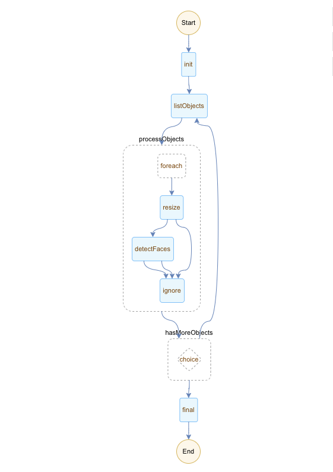

## 简介

本方案演示了如何使用[函数工作流](https://www.aliyun.com/product/fnf)和[函数计算](https://www.aliyun.com/product/fc)批量处理 OSS Bucket 下的图片文件。该流程包含以下步骤：

1. 调用函数任务列举 OSS 某路径下的图片文件，返回文件列表。
2. 并行处理步骤一返回的所有文件，对每一个图片串行做如下处理：
    1. 调用函数任务做缩放处理，处理结果存入 OSS。
    2. 调用函数任务做人脸识别，并标注人脸，将标注后的文件存入 OSS。
3. 判断是否还有更多文件，如是，则继续步骤一，否则结束流程。



## 优势
1. 支持长时间运行流程。由于将流程分解为多个步骤，只需要确保每个步骤能够在函数计算时间限制（10分钟）内完成即可，流程总时长限制为一年。
2. 并发处理能力。依赖于 FnF 的并行调度能力和函数计算的自动扩展能力，可以对数据并行处理。
3. 高可靠性和高容错性。由于涉及分布式操作（读取和写入 OSS 数据，执行函数等），各种异常（网络，硬件等）都可能导致步骤执行失败。利用 FnF 的失败重试和捕获功能，能够最大限度保证流程执行顺利完成。
4. 更少的代码做更多的事。支持多种控制原语，例如顺序，分支，并行等，尽量减少业务中实现重复的编排代码。
5. Serverless。 FnF 根据实际执行步骤转换个数收费，执行结束不再收费。免于管理硬件预算和扩展。

## 扩展场景
1. 使用函数计算的[定时触发器功能](https://help.aliyun.com/document_detail/68172.html)定时执行流程自动处理数据。例如，程序在某个小时上传的文件会存入 OSS Bucket 的相应路径下（2019-05-01T02），定时触发器在下个小时通过调用 FnF [StartExecution](https://help.aliyun.com/document_detail/122628.html) API 执行流程，处理上个小时的数据。
2. 对 OSS Bucket 下的对象（视频，图片，数据）处理，结果存入 OSS。
3. 将文件存储（NAS）的文件转存至 OSS。
4. 对日志服务（LogHub）数据处理（聚合，压缩等），结果存入 OSS。

## 使用步骤

1. 使用[Funcraft](https://help.aliyun.com/document_detail/64204.html)部署函数

    ```fun deploy -t template.yml```

2. 使用[阿里云 CLI](https://help.aliyun.com/document_detail/122611.html) 创建流程。使用控制台请参见[文档](https://help.aliyun.com/document_detail/124155.html)。流程定义使用[oss-flow.yaml](./flows/oss-flow.yaml)。

    ```aliyun fnf CreateFlow --Description "demo" --Type FDL --Name oss-image-process --Definition "$(<./flows/oss-flow.yaml)" --RoleArn acs:ram::account-id:role/fnf```

3. 使用[阿里云 CLI](https://help.aliyun.com/document_detail/122611.html) 执行流程。使用控制台请参见[文档](https://help.aliyun.com/document_detail/124156.html)。执行使用下面的输入格式。该输入将会处理 `hangzhouhangzhou` 的所有文件。
    
    ```aliyun fnf StartExecution --FlowName oss-image-process --Input '{"bucket": "hangzhouhangzhou", "prefix": ""}' --ExecutionName run1```
